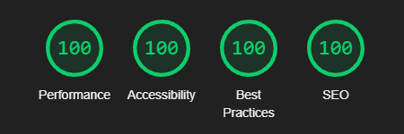

**Сайт сети пансионатов для пожилых людей.**
---

Статичные файлы и статичный сайт, размещенный на Github Pages, находятся в папке "docs".

Дизайн сайта сделан с нуля, включая обработку фотографий и создание макета сайта.

Программирование полностью сделано вручную, включая такие элементы, как:
- Адаптивное прогрессивно сворачивающееся меню, переходящее в мобильное меню на маленьких экранах.
- Шапка сайта при прокрутке уменьшается в размере и фиксируется.
- Плавная прокрутка к секциям.
- Отложенная загрузка фотографий, обложек видео, карты.
- Ровная плитка без пробелов из фотографий разного размера (masonry layout).
- Слайдер картинок с отложенной загрузкой, навигацией с клавиатуры и навигацией проведением пальцем по экрану.
- Асинхронная отправка формы.
- Серверная часть для отправки писем с использованием Node.js с модулем Nodemailer.

Файлы CSS и JS разбиты на главы, между которыми можно переключаться выполняя поиск по "/**".

